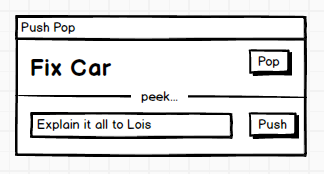
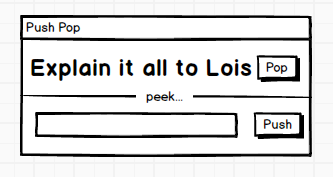
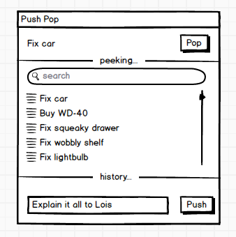

# pushpop

*mental stack manager*

You're working on one problem, when another problem arises... or perhaps an interruption occurs... now you need to push the new thing on top of your mental stack. Start solving the new problem, but be ready to come back to the old problem.

What do you do?

`pushpop` is a mental stack manager.

It lets you see the top of your mental stack.

## Pop

When you've completed a task, click `pop`. (it makes a nice popping sound) and that task is gone.

The next item rises back to the top of the stack.

## Push

But wait... you are interrupted in your quest to complete the item on top of the stack.

What do you do? You enter the new item into the textbox, and `push` it. Now that item is on top.

## Peek

There's one more feature... `peek...`

Peek let's you inspect the entire mental stack. You can drag items around to reorder them. You can search for items (and can move the item you find to the top of the stack).

Finished peeking? Click `peeking...` to hide the stack away.

OK, OK, nerdy note... in proper '[stack](https://en.wikipedia.org/wiki/Stack_(abstract_data_type))' parlance, 'peek' is the operation that lets you see the item on top of the stack without popping it. Looking at the entire stack is called 'snooping' (well that's the slang term we used at university when i was kid...) But I'm using Peek here because I like the aliteration. The CLI would call it 'snoop' however.

## History

While peeking, you can also view previously completed items, if you click `history...`.

## Current status

As you can see from the balsamiq mockups above, this is just in the idea phase. It's based on [Next Action](http://www.timesnapper.com/NextAction/)

## CLI

There could be a command-line interface.

    pushpop --peek                 # shows you what's on top
    pushpop --push "debug the sql" # puts a new item on top of your mental stack
    pushpop --pop                  # returns the top most item, but also removes it from the stack (and archives it?)
    pushpop --snoop                # shows all items currently in the stack, from top to bottom.
    pushpop --history              # shows all completed (i.e. previously popped items) including datetime of completion.
    pushpop --help                 # provides help with pushpop and life in general

## Implementation

Well I've done the hard part, thinking it up and making mockups. Implementation is left as exercise for the reader. I suggest [electron](http://electron.atom.io/). Send me a pull request when you're done.

If the stack was stored in the cloud then you could also have iOS/android version for managing your mental stack while on the move.

## Last thing

I didn't mention Yak Shaving. Why didn't I mention yak shaving? Here's a yak in need of a shave:

Yak image from [wikimedia commons](https://commons.wikimedia.org/wiki/File:Yak_Yama.jpg)

---

